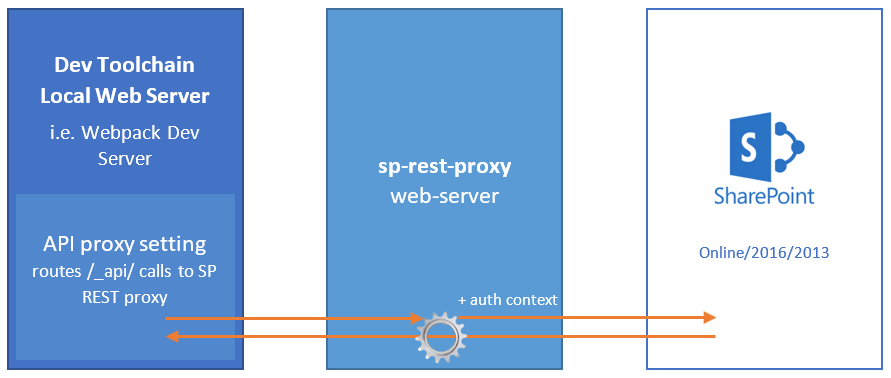
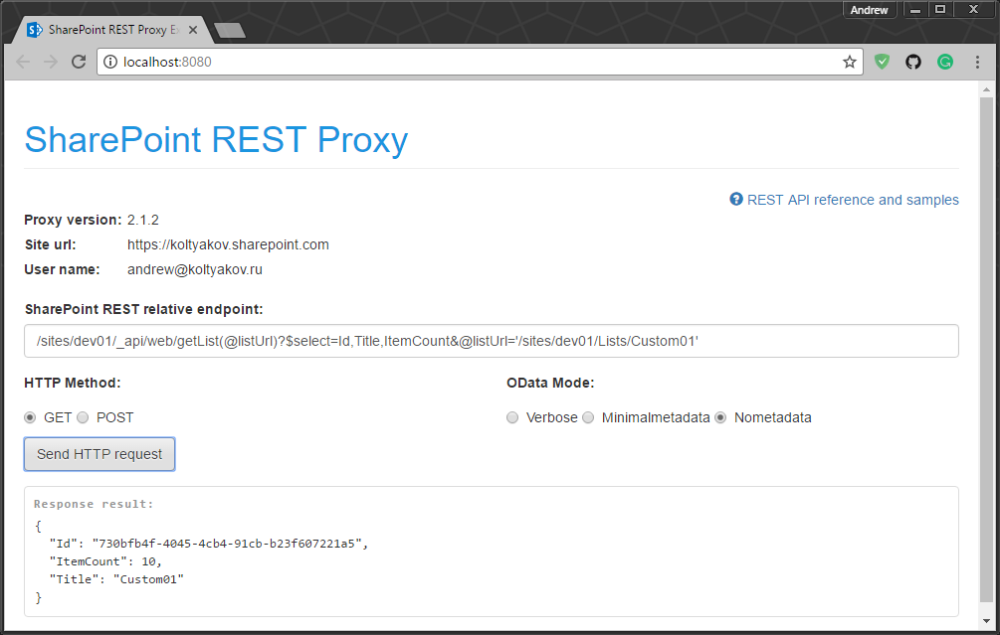
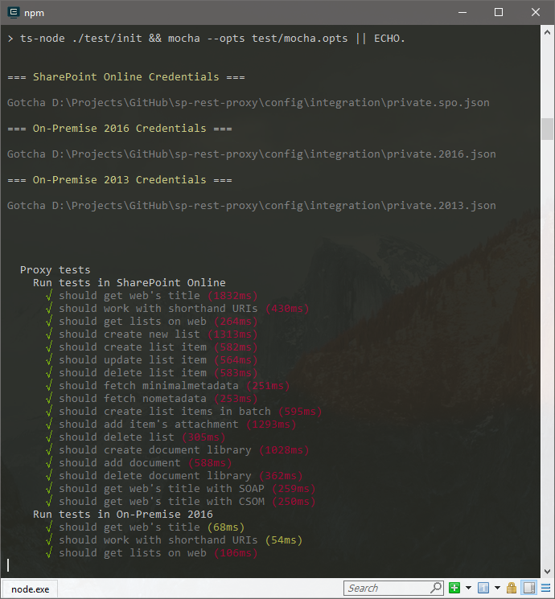

# sp-rest-proxy - SharePoint REST API Proxy for local Front-end development tool-chains

[](https://nodei.co/npm/sp-rest-proxy/)

[](https://badge.fury.io/js/sp-rest-proxy)
[](https://www.npmjs.com/package/sp-rest-proxy)
[](https://koltyakov.visualstudio.com/SPNode/_build/latest?definitionId=7&branchName=master)
[](https://app.fossa.io/projects/git%2Bgithub.com%2Fkoltyakov%2Fsp-rest-proxy?ref=badge_shield)
[](https://gitter.im/sharepoint-node/Lobby)

> Allows performing API calls to local Express application with forwarding the queries to a remote SharePoint instance.

Original concept of the proxy was created to show how it could be easy to implements real world data communications for SharePoint Framework local serve mode during web parts debug without deployment to SharePoint tenant. Now the tool is used with multiple teams for modern front-end solutions [rapid development](https://github.com/koltyakov/sp-rest-proxy#development-paradigms).



## Supports SPFx and PnP JS

## Supported SharePoint versions

- SharePoint Online
- SharePoint On-Prem (2019/2016/2013/2010)

## Development paradigms

- SPA development ([Angular](http://johnliu.net/blog/2017/9/angular-4-sharepoint-on-premises-localhost-development-and-sp-rest-proxy), [React](https://www.linkedin.com/pulse/getting-started-react-local-development-sharepoint-andrew-koltyakov/), Vue.js, etc.) in serve mode against real data for On-Prem and Online
- [SharePoint Framework with local workbench](https://www.linkedin.com/pulse/local-spfx-workbench-against-real-sharepoint-api-andrew-koltyakov/)
- [SharePoint AddIns development](https://github.com/koltyakov/sp-rest-proxy/issues/41)

## Supports proxying

- REST API
- CSOM requests
- SOAP web services
- Static resources

## Proxy modes

- API Proxy server
- Socket gateway server
- Socket gateway client
- Custom Express apps embed mode

Socket proxying allows to forward API from behind NAT (experimental).

## How to use as a module

1\. Install NPM module in the project:

```bash
npm install sp-rest-proxy --save-dev
```

2\. Create server.js with the following code:

```javascript
const RestProxy = require('sp-rest-proxy');

const settings = {
  configPath: './config/private.json', // Location for SharePoint instance mapping and credentials
  port: 8080,                          // Local server port
  staticRoot: './static'               // Root folder for static content
};

const restProxy = new RestProxy(settings);
restProxy.serve();
```

[Configuration parameters cheatsheet](https://github.com/koltyakov/sp-rest-proxy/tree/master/docs/authparameters.md)

3\. Add npm task for serve into package.json:

```json
"scripts": {
  "serve": "node ./server.js"
}
```

Check if the path to server.js is correct.

4\. Run `npm run serve`.

5\. Provide SharePoint configuration parameters.

6\. Test local API proxy in action.

## How to develop

### Install

1\. Clone/fork the project:

```bash
git clone https://github.com/koltyakov/sp-rest-proxy
```

2\. CMD to the project folder.

3\. Install dependencies:

```bash
npm install
```

4\. Build:

```bash
npm run build
```

5\. Run the server:

```bash
npm run serve
```

or serve in TypeScript directly

```bash
npm run ts-serve
```

Prompts credentials for a SharePoint site.

6\. Navigate to `http://localhost:8080` (or whatever in settings)

7\. Ajax REST calls as if you were in SharePoint site page context:



8\. Tests.

```bash
npm run test
```



## Webpack Dev Server

```javascript
/* webpack.config.js */
const RestProxy = require('sp-rest-proxy');

const port = process.env.WEBPACK_DEV_SERVER_PORT || 9090;

module.exports = {
  // Common Webpack settings
  // ...
  devServer: {
    watchContentBase: true,
    writeToDisk: true,
    port,
    before: (app) => {
      // Register SP API Proxy
      new RestProxy({ port }, app).serveProxy();

      // Other routes
      // ...
    }
  }
};
```

## TypeScript support

In early days of `sp-rest-proxy`, the library was written in ES6 and used `module.exports` which was kept after migrating to TypeScript later on for the backward compatibility reasons.

In TypeScript, it's better to import the lib from `sp-rest-proxy/dist/RestProxy` to get advantages of types:

```typescript
import RestProxy, { IProxySettings } from 'sp-rest-proxy/dist/RestProxy';

const settings: IProxySettings = {
  configPath: './config/private.json'
};

const restProxy = new RestProxy(settings);
restProxy.serve();
```

## Authentication settings

The proxy provides wizard-like approach for building and managing config files for [`node-sp-auth`](https://github.com/s-KaiNet/node-sp-auth) (Node.js to SharePoint unattended http authentication).

- SharePoint Online:
  - User credentials (SAML/ADFS)
  - Add-In Only permissions
  - On-Demand authentication (using Electron popup)
- SharePoint 2019, 2016, 2013:
  - User credentials (NTLM, NTLM v2)
  - ADFS user credentials
  - Form-based authentication (FBA)
  - Form-based authentication (Forefront TMG)
  - Add-In Only permissions
  - On-Demand authentication (using Electron popup)
- SharePoint 2010:
  - User credentials (NTLM, NTMLv2)
  - Form-based authentication (FBA)
  - Form-based authentication (Forefront TMG)

For more information please check node-sp-auth [credential options](https://github.com/s-KaiNet/node-sp-auth#params) and [wiki pages](https://github.com/s-KaiNet/node-sp-auth/wiki).
Auth settings are stored inside `./config/private.json`.

## PnPjs

sp-rest-proxy works with PnPjs (check out [brief notice](https://github.com/koltyakov/sp-rest-proxy/issues/26) how to configure).


### Load page context helper

sp-rest-proxy includes helper method for configuring page context - `loadPageContext`.

```typescript
import { loadPageContext } from 'sp-rest-proxy/dist/utils/env';
import { Web } from '@pnp/sp';

// loadPageContext - gets correct URL in localhost and SP environments
loadPageContext().then(async () => {

  // In both localhost and published to SharePoint page
  // `_spPageContextInfo` will contain correct info for vital props

  // PnPjs's Web object should be created in the following way
  const web = new Web(_spPageContextInfo.webAbsoluteUrl);

  // Then goes ordinary PnPjs code
  const batch = web.createBatch();

  const list = web.getList(`${_spPageContextInfo.webServerRelativeUrl}/List/ListName`);
  const entityName = await list.getListItemEntityTypeFullName();

  [1, 2, 3, 4].forEach((el) => {
    list.items.inBatch(batch).add({
      Title: `${el}`
    }, entityName);
  });

  await batch.execute();
  console.log('Done');

}).catch(console.warn);
```

## JSOM (SharePoint JavaScript Object Model)

JSOM can be used in local development mode with sp-rest-proxy with some additional setup.

The local development workbench page should contain JSOM init scripts:

```html
<script type="text/javascript" src="/_layouts/15/1033/initstrings.js"></script>
<script type="text/javascript" src="/_layouts/15/init.js"></script>
<script type="text/javascript" src="/_layouts/15/MicrosoftAjax.js"></script>
<script type="text/javascript" src="/_layouts/15/sp.core.js"></script>
<script type="text/javascript" src="/_layouts/15/sp.runtime.js"></script>
<script type="text/javascript" src="/_layouts/15/sp.js"></script>
```

Check out the [example](https://github.com/koltyakov/sp-rest-proxy/blob/master/test/manual/static/jsom.html).

## SharePoint Framework

[Blog post article with setting up SPFx and Proxy](https://www.linkedin.com/pulse/local-spfx-workbench-against-real-sharepoint-api-andrew-koltyakov/)

## Use cases

- Client side applications development with local serve, but real data from SharePoint
- SharePoint Framework in local workbench with real data
- Client applications integration test automation scenarios

## Usage with Docker

- [Docker Hub](https://hub.docker.com/r/koltyakov/sp-rest-proxy/)
- [Local example](https://github.com/koltyakov/sp-rest-proxy/tree/master/docker)


## License
[](https://app.fossa.io/projects/git%2Bgithub.com%2Fkoltyakov%2Fsp-rest-proxy?ref=badge_large)
