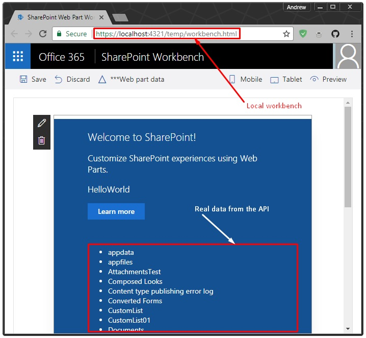

## spfx-proxy-example

### Install dependencies

```bash
npm install
```

### Configure proxy

```bash
npm run proxy
```

Follow the wizard instaructions.

### Configure SharePoint Web URL

Open `./src/webparts/settings.ts` and change:

```TypeScript
// Should be updated with environment web relative URL
export const webRelativeUrl = '/sites/dev-a';
```

'/sites/dev-a' to your SharePoint web URL.

### Run dev mode with proxy

```bash
npm run serve
```

### Add HelloWorld web part on the page



Done!